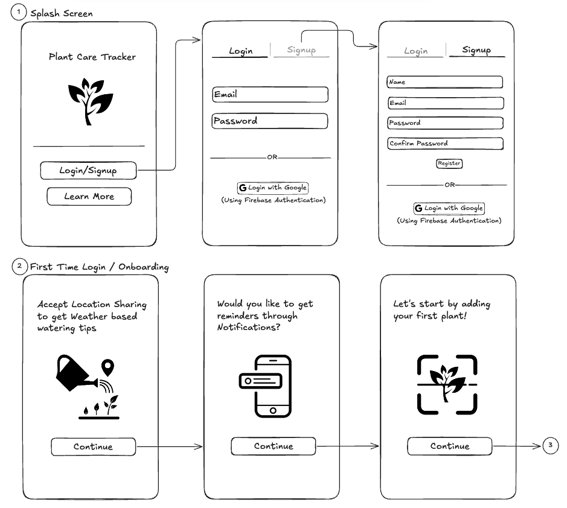
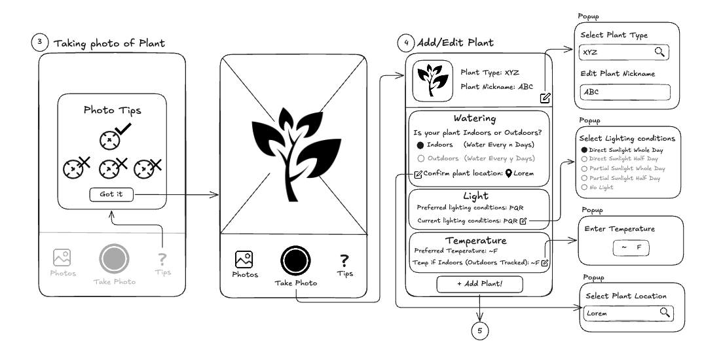
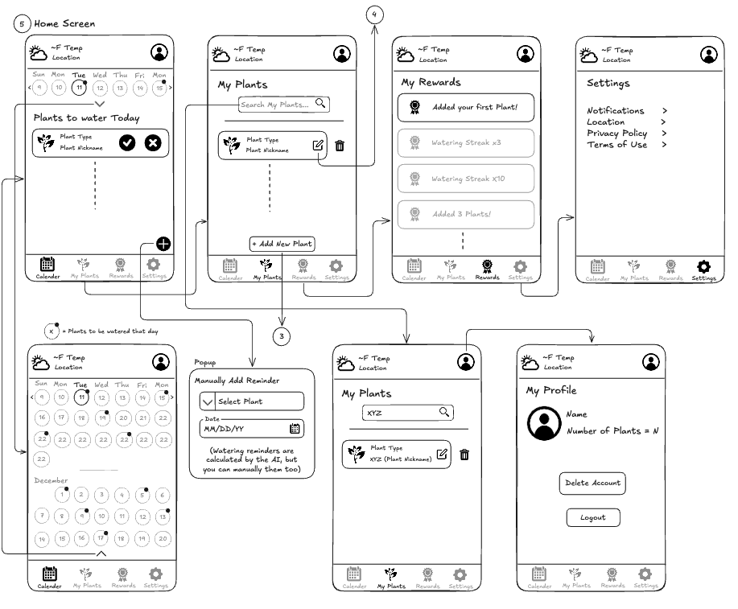
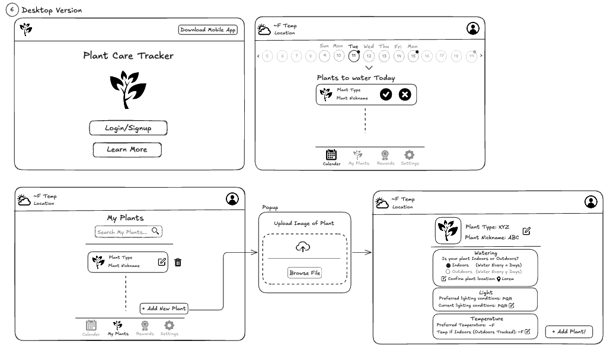

# Module 2 Group Assignment

CSCI 5117, Fall 2025, [assignment description](https://canvas.umn.edu/courses/518559/pages/project-2)

## App Info:

- Team Name: Pied Piper
- App Name: Plant Care Tracker
- App Link: <https://planttracker-35804.web.app/>

### Students

- Arunachalam Manikandan, manik063@umn.edu
- Aswatha Sadasivam, sadas021@umn.edu
- Erina Karati, karat029@umn.edu
- Poorna Bengaluru Shivaji Rao, benga013@umn.edu
- Prajwal Umesha, umesh006@umn.edu

## Key Features

**Describe the most challenging features you implemented
(one sentence per bullet, maximum 4 bullets):**

- Scheduled push notifications using Firebase Cloud Functions that check user reminder times every minute and send personalized plant care reminders
- AI-powered plant identification using device camera and Google Gemini Vision API to automatically identify plants and populate care details
- Gamification system with XP rewards, leveling progression, and achievement unlocking with animated celebration dialogs
- Dynamic care scheduling with custom frequency intervals and intelligent calendar visualization that calculates exact due dates for watering, fertilizing, and maintenance tasks

Which (if any) device integration(s) does your app support?

- Camera (for plant photo capture and AI identification)
- Geolocation (for weather data and location-based recommendations)
- Push Notifications (for daily care reminders)
- Local Storage (for user preferences and offline data)

Which (if any) progressive web app feature(s) does your app support?

- Installable to home screen with custom app icon and splash screen
- Service worker for offline functionality and asset caching
- Push notifications with Firebase Cloud Messaging (FCM)
- Responsive design optimized for mobile, tablet, and desktop devices
- Manifest file with theme colors and display modes

## Mockup images

**[Add images/photos that show your mockup](https://stackoverflow.com/questions/10189356/how-to-add-screenshot-to-readmes-in-github-repository) along with a very brief caption:**

**Excalidraw Mockup Link:** https://excalidraw.com/#json=ff5_By1l6aKMJXYtDQTtE,ia-uh1jAGRetKwbrHvpuzw

## Testing Notes

**Is there anything special we need to know in order to effectively test your app? (optional):**

- ...

## Screenshots of Site (complete)

**[Add a screenshot of each key page](https://stackoverflow.com/questions/10189356/how-to-add-screenshot-to-readmes-in-github-repository)
along with a very brief caption:**

## External Dependencies

**Document integrations with 3rd Party code or services here.
Please do not document required libraries (e.g., VUE, Firebase, vuefire).**

- Google Gemini AI (Gemini 2.5 Flash): AI-powered plant identification from photos, provides species name and care recommendations
- OpenWeatherMap API: Real-time weather data and 5-day forecasts based on user location for plant care insights
- Firebase Cloud Functions: Server-side scheduled tasks for sending daily reminder notifications at user-specified times
- Firebase Cloud Messaging (FCM): Push notification delivery service for plant care reminders
- Vuetify 3: Material Design component framework for UI elements and styling
- Axios: HTTP client for making API requests to weather and AI services

**If there's anything else you would like to disclose about how your project
relied on external code, expertise, or anything else, please disclose that
here:**

...
