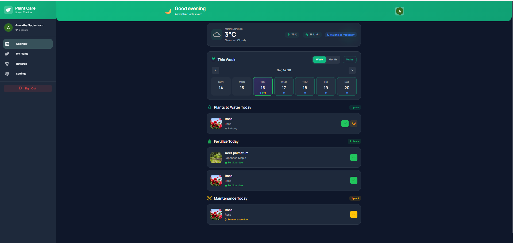
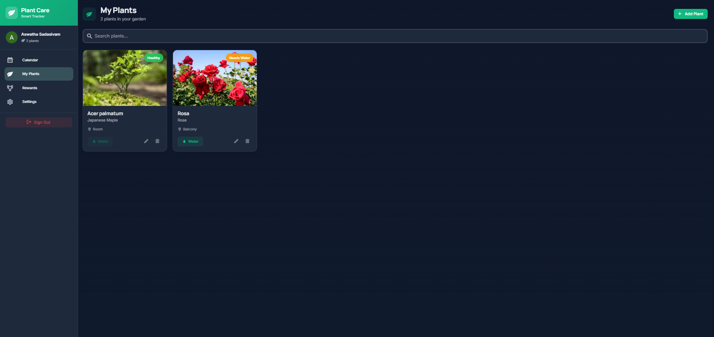
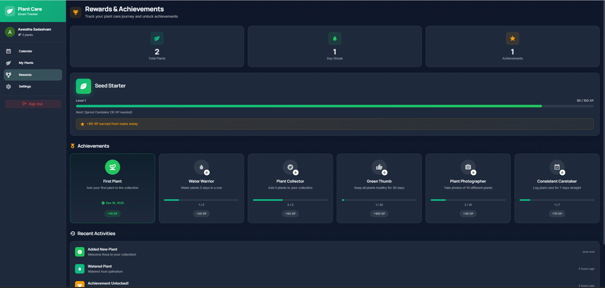
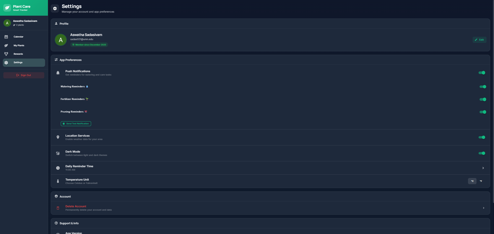

# Module 2 Group Assignment

CSCI 5117, Fall 2025, [assignment description](https://canvas.umn.edu/courses/518559/pages/project-2)

## App Info:

- Team Name: Pied Piper
- App Name: Plant Care Tracker
- App Link: <https://TODO.com/>

### Students

- Arunachalam Manikandan, manik063@umn.edu
- Aswatha Sadasivam, sadas021@umn.edu
- Erina Karati, karat029@umn.edu
- Poorna Bengaluru Shivaji Rao, benga013@umn.edu
- Prajwal Umesha, umesh006@umn.edu

## Key Features

**Describe the most challenging features you implemented
(one sentence per bullet, maximum 4 bullets):**

- ...

Which (if any) device integration(s) does your app support?

- ...

Which (if any) progressive web app feature(s) does your app support?

- ...

## Mockup images

**[Add images/photos that show your mockup](https://stackoverflow.com/questions/10189356/how-to-add-screenshot-to-readmes-in-github-repository) along with a very brief caption:**

**Excalidraw Mockup Link:** https://excalidraw.com/#json=ff5_By1l6aKMJXYtDQTtE,ia-uh1jAGRetKwbrHvpuzw

## Testing Notes

**Is there anything special we need to know in order to effectively test your app? (optional):**

- ...

## Screenshots of Site (complete)

**[Add a screenshot of each key page](https://stackoverflow.com/questions/10189356/how-to-add-screenshot-to-readmes-in-github-repository)
along with a very brief caption:**

### 1. Home Dashboard

*The main dashboard showing weather integration, weekly calendar, and quick status overview.*

### 2. My Plants Collection

*The digital garden view where users can manage their plant collection, filter by type, and add new plants.*

### 3. Rewards & Achievements

*Gamification hub displaying user level, XP progress, and unlocked badges for plant care milestones.*

### 4. Settings & Profile

*User preferences including notification toggles, dark mode, and profile management.*

## External Dependencies

**Document integrations with 3rd Party code or services here.
Please do not document required libraries (e.g., VUE, Firebase, vuefire).**

- Library or service name: description of use
- ...

**If there's anything else you would like to disclose about how your project
relied on external code, expertise, or anything else, please disclose that
here:**

...
